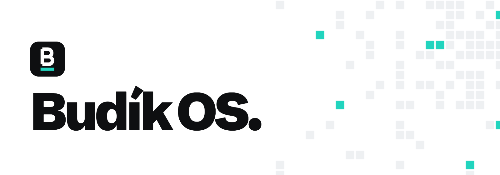
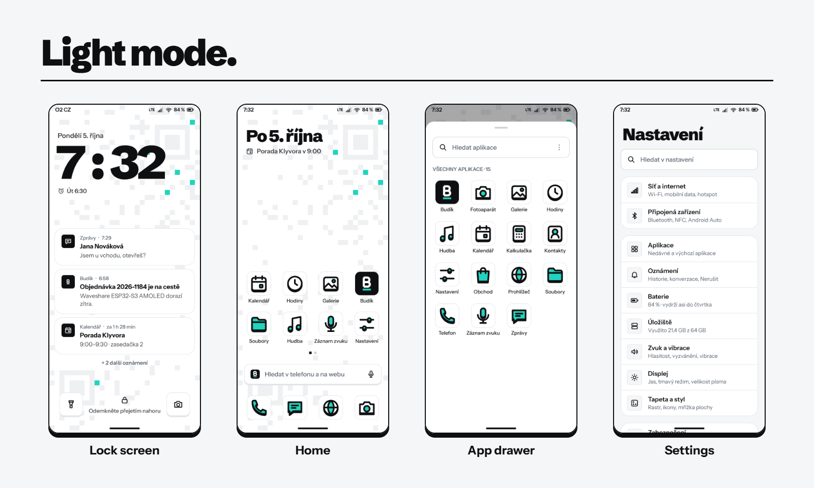

<picture>
  <source media="(prefers-color-scheme: dark)" srcset="docs/images/header-dark.png">
  
</picture>

Budík OS is an Android 17 based operating system for phones that the manufacturers stopped updating. It runs a current Android release on older hardware, with its own interface, a tuned kernel and a small memory footprint.

The system is built from the GrapheneOS source tree as a Generic System Image, with TrebleDroid and RestlessOS patches that let Android 17 run on older kernels and vendor images. Device-specific work (kernel, overlays, SELinux fixes) lives separately for each phone.

<picture>
  <source media="(prefers-color-scheme: dark)" srcset="docs/images/screens-dark.png">
  
</picture>

## Status

Early development. Builds boot and run, but expect rough edges and breaking changes between builds. Do not install it on a phone you cannot afford to wipe.

## Devices

| Device | Codename | Status |
| --- | --- | --- |
| Motorola moto g7 power | `ocean` | In development |
| Samsung Galaxy A12 | `a12` | Planned |
| Samsung Galaxy A13 | `a13` | Planned |

More devices will be added over time. Because the system part is a GSI, most Treble-compliant phones with an unlockable bootloader are realistic targets.

<picture>
  <source media="(prefers-color-scheme: dark)" srcset="docs/images/what-works-dark.png">
  
</picture>

Tested on `ocean`:

- [x] Boot with the Budík kernel
- [x] Camera and flashlight
- [x] Split shade: notifications on the left, control centre on the right
- [x] Performance profiles (battery, balanced, performance) and compressed RAM swap
- [x] Setup wizard
- [x] Volume dialog and power menu
- [x] Budík icons, fonts, wallpapers, boot logo and boot animation
- [ ] Calls, mobile data, Wi-Fi, Bluetooth and GPS are being tested

<picture>
  <source media="(prefers-color-scheme: dark)" srcset="docs/images/known-issues-dark.png">
  
</picture>

- Lock screen and home screen still use the stock layout; the redesign is in progress.
- Some system apps (Phone, Messages, Files) do not follow the system design yet.
- RCS needs Google Messages, which can be installed through sandboxed Google Play.
- The bootloader stays unlocked, so Play Integrity reports basic integrity only.

## Building

The system image is a Generic System Image built from the GrapheneOS tree with the RestlessOS patches and the Budík OS layer from this repository. All Android build steps run in a Docker container, so the host only needs Docker and git.

Requirements:

- x86-64 Linux host with Docker
- about 600 GB of free disk space (sources, build output and ccache)
- 64 GB of RAM or more; lower `JOBS` on smaller machines

### Setup

```
git clone https://github.com/BudikOS/budik-os
cd budik-os
export BUDIK_ROOT=~/budikos
git clone -b android-17.0 https://github.com/cawilliamson/treble_restlessos "$BUDIK_ROOT/restless"
docker build --build-arg UID="$(id -u)" --build-arg GID="$(id -g)" -t budikos-build:24.04 build/
build/fetch-fonts.sh
```

`BUDIK_ROOT` (default `~/budikos`) holds everything the build produces: `src/` (the Android tree), `restless/`, `keys/`, `ccache/`, `logs/` and `out/` (finished images). Keep it outside this checkout.

### Build

```
build/sync.sh                 # GrapheneOS sources, latest stable tag
build/apply.sh                # RestlessOS patch tiers, Budík OS layer and patches
build/keys.sh                 # your own signing keys, once
DEBUG_BUILD=1 build/build.sh  # signed image in $BUDIK_ROOT/out
```

Each script re-runs itself inside the `budikos-build:24.04` container. `build/pipeline.sh` runs `apply`, `keys` and `build` in a row with logs in `$BUDIK_ROOT/logs`; `build/pipeline.sh build` rebuilds without touching the tree.

| Variable | Used by | Meaning |
| --- | --- | --- |
| `BUDIK_ROOT` | all | working directory, default `~/budikos` |
| `GRAPHENEOS_TAG` | `sync.sh` | pin a GrapheneOS release instead of the latest stable one |
| `SYNC_JOBS`, `SYNC_NET_JOBS` | `sync.sh` | repo sync parallelism (default 16 and 4) |
| `FULL=1` | `apply.sh` | reset the whole tree and apply everything again |
| `DEBUG_BUILD=1` | `apply.sh`, `build.sh` | `userdebug` instead of `user` |
| `JOBS`, `NINJA_HIGHMEM_NUM_JOBS` | `build.sh` | build parallelism; the high-memory pool (R8, D8, metalava) defaults to 10 |
| `KEY_SUBJECT` | `keys.sh` | certificate subject, default `/C=CZ/O=BudikOS/CN=BudikOS` |

`apply.sh` is incremental: after the first full run it only refreshes the Budík OS layer and re-applies projects whose patches changed. `build/check-patches.sh` checks that the whole patch set applies on a clean base without touching the tree.

### Signing keys

`build/keys.sh` generates a release key set in `$BUDIK_ROOT/keys` (mode 700, never inside the source tree) and installs it as `vendor/budikos-priv` for the signing step. Existing keys are never replaced. Back the directory up: an image signed with different keys cannot be installed over an existing installation without a data wipe. Never commit or publish these keys.

To get adb without the authorisation prompt on `userdebug` builds, put your `~/.android/adbkey.pub` into `vendor/budikos/dev/adb_keys`. The file is ignored by git.

### Building on a remote host

`build/push.sh` copies this checkout to a build host, `build/watch.sh` follows the pipeline log and `build/fetch.sh` downloads the newest image as a sparse image. They read `BUDIK_HOST` (ssh destination, with keys and ports in `~/.ssh/config`), `BUDIK_REMOTE_ROOT` (default `budikos`), `BUDIK_REMOTE_REPO` (default `budikos/budik-os`) and `BUDIK_SESSION` (tmux session of the pipeline, default `budikos`).

### Kernel (ocean)

The kernel is the LineageOS 4.9 kernel for SDM632 with one patch and a config fragment. It needs clang, lld, an `aarch64-linux-gnu` and `arm-linux-gnueabi` toolchain, `dtc` and `lz4`.

```
git clone --depth 1 -b lineage-22.2 https://github.com/LineageOS/android_kernel_motorola_sdm632 kernel-src
git -C kernel-src am "$PWD"/budik-os/kernel/patches/*.patch
export KERNEL_SRC="$PWD/kernel-src"
budik-os/kernel/build.sh budik-os/kernel/budik_perf.config
BASE_BOOT=lineage-boot.img budik-os/kernel/pack.sh boot-budik.img
```

`BASE_BOOT` is the `boot.img` of the LineageOS 22.2 build for ocean; `pack.sh` keeps its ramdisk and command line and replaces the kernel.

Motorola's bootloader does not support `fastboot boot`, so a new kernel has to be flashed. Back up the boot partition first, either by keeping the `boot.img` you started from or from a running `userdebug` build:

```
adb root
adb shell dd if=/dev/block/bootdevice/by-name/boot_b of=/data/local/tmp/boot_b.img
adb pull /data/local/tmp/boot_b.img
```

If the new kernel does not boot, restore the backup with `fastboot flash boot_b boot_b.img`.

### Installing on ocean

The phone needs an unlocked bootloader and the LineageOS 22.2 firmware and vendor image, which is what the system image is tested against. Convert the image to a sparse image and flash the system partition of the slot you boot:

```
$BUDIK_ROOT/src/out/host/linux-x86/bin/img2simg BudikOS-arm64-ab-*.img system.simg
fastboot getvar current-slot
fastboot -S 256M flash system_b system.simg
fastboot flash boot_b boot-budik.img
```

Coming from another system, or from a build signed with other keys, also needs `fastboot -w`, which **erases all user data**.

## Repository layout

| Path | Contents |
| --- | --- |
| `build/` | build container, the sync, apply, keys and build stages, remote helpers |
| `vendor/budikos/` | product layer: overlays, icons, wallpapers, boot animation, BudikSetup and BudikControl apps, init performance profiles, SELinux policy |
| `patches/` | patches to AOSP projects, one directory per project path, applied in file name order |
| `kernel/` | kernel config fragment, patch, build and boot image scripts |
| `tools/` | icon overlay generators, Motorola `logo.bin` tool, contrast and frame timing checks |
| `docs/` | images used in this README |

## Contributing

Bug reports and pull requests are welcome. Please read [CONTRIBUTING.md](CONTRIBUTING.md) first. Security issues go through [SECURITY.md](SECURITY.md), not public issues.

## Related projects

- [budikstore.org](https://budikstore.org)
- [erp.budikstore.org](https://erp.budikstore.org)

## Credits

Budík OS would not exist without [AOSP](https://source.android.com), [GrapheneOS](https://grapheneos.org), [TrebleDroid](https://github.com/TrebleDroid), [RestlessOS](https://github.com/cawilliamson/treble_restlessos) and [LineageOS](https://lineageos.org). Fonts: [Schibsted Grotesk](https://github.com/schibsted/schibsted-grotesk) and [Instrument Sans](https://github.com/Instrument/instrument-sans), both under the SIL Open Font License.

## License

Budík OS is licensed under the [GNU General Public License v3.0](LICENSE). Code taken from upstream projects keeps its original license: AOSP and GrapheneOS components are Apache 2.0, kernel patches are GPL-2.0.
